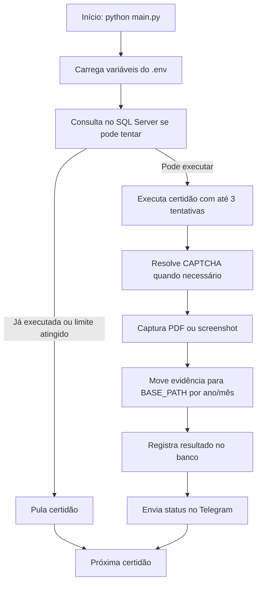

# CND Regex — Automação de Certidões Negativas

<p align="center">
  <strong>Robô Python para emissão, captura, organização e auditoria operacional de Certidões Negativas de Débito.</strong>
</p>

<p align="center">
  
  
  
  
</p>

---

## Visão geral

O **CND Regex** é uma automação operacional para emissão de certidões em portais públicos, com foco em reduzir esforço manual, padronizar o armazenamento dos documentos e criar rastreabilidade diária das tentativas de emissão.

A solução executa fluxos de navegação com **Selenium**, resolve CAPTCHAs via **Anti-Captcha**, move arquivos gerados para uma estrutura de diretórios por competência, registra tentativas em **SQL Server** e envia notificações por **Telegram** com mensagens, evidências e prints de execução.

> Projeto indicado para rotinas internas de backoffice, contabilidade, fiscal, financeiro ou jurídico que necessitam acompanhar certidões de forma recorrente e auditável.

---

## Certidões automatizadas

| Certidão | Portal / Origem | Saída esperada | Estratégia de evidência |
| --- | --- | --- | --- |
| **FGTS / CRF** | Caixa Econômica Federal | Print da certidão | Captura de tela com validade e número de emissão |
| **Trabalhista** | TST / Justiça do Trabalho | PDF da certidão | PDF movido + print enviado ao Telegram |
| **Municipal** | Portal de Serviços de Diadema/SP | Print da certidão | Captura da página final com validade e emissão |
| **Dívida Ativa** | Procuradoria / CRDA | PDF da certidão | PDF movido + print da execução |

---

## Principais capacidades

- **Automação web end-to-end** com Selenium e ChromeDriver gerenciado automaticamente.
- **Resolução de CAPTCHA de imagem e reCAPTCHA** por integração com Anti-Captcha.
- **Controle de tentativas por certidão** para evitar reprocessamento desnecessário no mesmo dia.
- **Registro de execução em banco SQL Server** com tentativas, resultado e data de execução.
- **Notificações operacionais via Telegram** com status, erros, prints e arquivos de evidência.
- **Organização por ano e mês** usando a estrutura configurada em `BASE_PATH`.
- **Rotina resiliente** com até três tentativas por certidão no orquestrador principal.

---

## Arquitetura do projeto

```text
Cnd_regex/
├── main.py              # Orquestração, automações Selenium, CAPTCHAs e movimentação de arquivos
├── config_banco.py      # Persistência de logs, controle de tentativas e consulta de status
├── config_telegram.py   # Abstração de envio de mensagens e imagens pelo Telegram
└── README.md            # Documentação técnica e operacional
```

### Responsabilidades por módulo

| Arquivo | Responsabilidade |
| --- | --- |
| `main.py` | Centraliza configuração de ambiente, criação do navegador, resolução de CAPTCHAs, emissão das certidões e fluxo principal de execução. |
| `config_banco.py` | Controla auditoria diária no SQL Server por meio das funções `registrar_log`, `pode_tentar` e `exibir_status_certidao`. |
| `config_telegram.py` | Encapsula o envio de mensagens e imagens para o Telegram por meio da classe `TelegramSend`. |

---

## Fluxo de execução



---

## Pré-requisitos

### Runtime

- Python **3.9+**.
- Google Chrome instalado.
- Acesso à internet para os portais públicos e para a API do Anti-Captcha.
- Driver ODBC do SQL Server instalado na máquina de execução.
- Permissão de escrita no diretório definido em `BASE_PATH`.

### Serviços externos

- Conta ativa no **Anti-Captcha** com saldo disponível.
- Bot do **Telegram** criado e `chat_id` válido.
- Base **SQL Server** com uma tabela de auditoria compatível com a rotina.

---

## Instalação

### 1. Clone o repositório

```bash
git clone <url-do-repositorio>
cd Cnd_regex
```

### 2. Crie e ative um ambiente virtual

```bash
# Windows
python -m venv .venv
.venv\Scripts\activate

# Linux / macOS
python3 -m venv .venv
source .venv/bin/activate
```

### 3. Instale as dependências

Caso o projeto ainda não possua um `requirements.txt` versionado, instale as bibliotecas utilizadas pelo código:

```bash
pip install selenium webdriver-manager python-dotenv pyodbc requests python-dateutil pyTelegramBotAPI
```

> Recomendação profissional: após validar o ambiente, gere e versione um arquivo `requirements.txt` com versões fixadas para garantir reprodutibilidade entre máquinas.

---

## Configuração de ambiente

Crie um arquivo `.env` na raiz do projeto. **Nunca versione esse arquivo**, pois ele contém credenciais e dados sensíveis.

```env
# Anti-Captcha
CHAVE_API=seu_token_anticaptcha

# Telegram
ITOKEN=token_do_bot
CHAT_ID=id_do_chat

# SQL Server
DB_HOST=servidor_sql
DB_NAME=nome_do_banco
DB_USER=usuario
DB_PASS=senha

# Dados cadastrais utilizados nas emissões
CNPJ_BASE=00000000
CNPJ_BASICO=00000000
CNPJ_SC=00000000000000
CPF=00000000000

# Diretório raiz para armazenamento das certidões
BASE_PATH=C:\Caminho\Para\Certidoes
```

### Variáveis utilizadas

| Variável | Obrigatória | Descrição |
| --- | --- | --- |
| `CHAVE_API` | Sim | Chave de API do Anti-Captcha. |
| `ITOKEN` | Sim | Token do bot do Telegram. |
| `CHAT_ID` | Sim | Identificador do chat/canal de destino. |
| `DB_HOST` | Sim | Host ou instância do SQL Server. |
| `DB_NAME` | Sim | Nome do banco de dados. |
| `DB_USER` | Sim | Usuário de conexão do banco. |
| `DB_PASS` | Sim | Senha de conexão do banco. |
| `CNPJ_BASE` | Sim | CNPJ base utilizado em alguns portais. |
| `CNPJ_BASICO` | Sim | CNPJ básico utilizado no fluxo do FGTS. |
| `CNPJ_SC` | Sim | CNPJ completo utilizado nas emissões. |
| `CPF` | Sim | CPF do solicitante usado no fluxo municipal. |
| `BASE_PATH` | Sim | Diretório raiz onde os documentos serão organizados. |

---

## Banco de dados

A rotina espera uma tabela `dbo.cnd_testes` para controlar tentativas e resultado diário por certidão.

### Modelo mínimo sugerido

```sql
CREATE TABLE dbo.cnd_testes (
    id INT IDENTITY(1,1) PRIMARY KEY,
    nome_certidao VARCHAR(100) NOT NULL,
    data_execucao DATETIME NOT NULL,
    tentativas INT NOT NULL,
    resultado BIT NOT NULL
);
```

### Semântica do controle

- `nome_certidao`: identifica o fluxo executado, por exemplo `fgts`, `trabalhista`, `municipal` ou `divida_ativa`.
- `tentativas`: quantidade de tentativas registradas no dia.
- `resultado`: `1` para sucesso e `0` para falha.
- A automação deixa de tentar uma certidão no dia quando já houve sucesso ou quando o limite de falhas foi atingido.

---

## Execução

Execute o robô principal:

```bash
python main.py
```

Por padrão, o fluxo principal percorre as certidões na seguinte ordem:

1. Dívida Ativa.
2. FGTS.
3. Trabalhista.
4. Municipal.

Cada etapa consulta o banco antes de executar, realiza até três tentativas no orquestrador e registra o resultado ao final.

---

## Organização dos arquivos gerados

Os documentos e evidências são salvos abaixo de `BASE_PATH`, separados por tipo de certidão, ano e mês:

```text
BASE_PATH/
├── CND_FGTS/
│   └── 2026/
│       └── 05 - Maio/
├── CND - Municipal/
│   └── 2026/
│       └── 05 - Maio/
├── CND - Trabalhista/
│   └── 2026/
│       └── 05 - Maio/
└── CND - Divida Ativa/
    └── 2026/
        └── 05 - Maio/
```

---

## Observabilidade e operação

A automação fornece feedback operacional por três canais:

1. **Terminal** — logs simples de tentativa, sucesso e falha.
2. **Telegram** — mensagens de sucesso, erro, status por certidão e envio de imagens.
3. **SQL Server** — histórico diário de tentativas e resultado consolidado.

Esse desenho facilita auditoria, acompanhamento remoto e investigação rápida de falhas nos portais de origem.

---

## Segurança

- Não armazene `.env`, tokens, senhas, prints sensíveis ou PDFs de certidões em repositórios públicos.
- Restrinja permissões da conta SQL apenas ao necessário para leitura/escrita da tabela de auditoria.
- Proteja o bot do Telegram e limite o acesso ao chat/canal de destino.
- Revise periodicamente capturas de tela e documentos gerados, pois podem conter dados pessoais ou fiscais.
- Use variáveis de ambiente em pipelines e servidores, evitando credenciais hardcoded.

---

## Boas práticas recomendadas

Para elevar a maturidade do projeto em ambientes profissionais, recomenda-se:

- Versionar um `requirements.txt` ou `pyproject.toml` com dependências fixadas.
- Criar um `.env.example` sem valores sensíveis para padronizar configuração.
- Isolar seletores Selenium por portal para facilitar manutenção quando páginas mudarem.
- Adicionar logs estruturados com `logging` em vez de apenas `print`.
- Adicionar testes unitários para funções puras e testes de integração controlados para banco/Telegram.
- Configurar execução agendada via Windows Task Scheduler, cron, Airflow, Prefect ou ferramenta equivalente.
- Adicionar tratamento centralizado para limpeza de arquivos temporários de CAPTCHA e screenshots.

---

## Troubleshooting

| Sintoma | Possível causa | Ação recomendada |
| --- | --- | --- |
| Chrome não abre | Chrome ausente ou ambiente sem interface gráfica | Instale o Chrome ou adapte a execução para modo headless. |
| Erro de ODBC | Driver SQL Server ausente ou string inválida | Instale o ODBC Driver 17/18 e valide host, banco, usuário e senha. |
| CAPTCHA não resolve | Saldo indisponível, API key inválida ou portal instável | Verifique saldo Anti-Captcha, chave e resposta da API. |
| PDF não encontrado | Download bloqueado, nome diferente ou pasta incorreta | Verifique pasta de downloads e permissões de escrita. |
| Telegram não envia | Token/chat inválidos ou bot sem permissão | Valide `ITOKEN`, `CHAT_ID` e permissões do bot no chat. |
| Portal mudou layout | XPaths desatualizados | Atualize seletores no fluxo correspondente. |

---

## Roadmap técnico sugerido

- [ ] Adicionar `requirements.txt` com versões fixadas.
- [ ] Criar `.env.example` documentado.
- [ ] Parametrizar modo headless por variável de ambiente.
- [ ] Padronizar nomenclatura de arquivos gerados.
- [ ] Adicionar camada de configuração tipada.
- [ ] Separar cada certidão em um módulo próprio.
- [ ] Criar pipeline de lint e testes.
- [ ] Implementar logs estruturados e rotação de arquivos de log.
